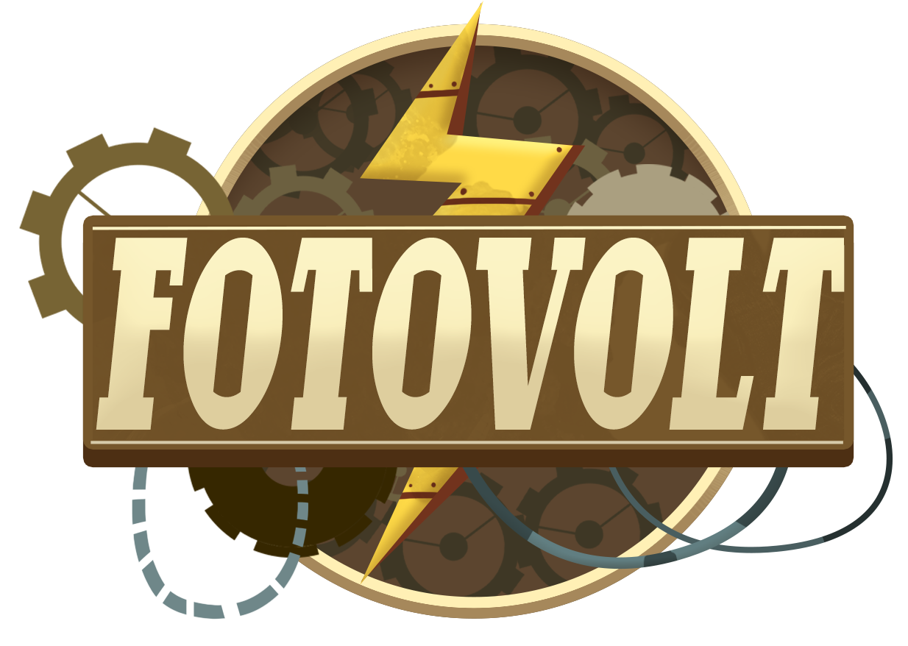

<!-- PROJECT LOGO -->
<br />
<div align="center">
  <a href="https://github.com/othneildrew/Best-README-Template">
    
  </a>

  <p align="center">
    An educational digital game to support photoelectric effect learning integrated with a remote lab.
  </p>
</div>

<!-- CITE AS -->
## Cite as
If you want to use Fotovolt in your research, you can cite this article which discusses the model in more detail. Cite it as follows:
```
Tulha, Carinna Nunes, Marco Antonio Garcia de Carvalho, and Vitor Rafael Coluci.
"Educational digital game integrated into a remote laboratory for learning physic concepts."
2019 ieee 19th international conference on advanced learning technologies (icalt).
Vol. 2161. IEEE, 2019.
```

```
Tulha, Carinna Nunes, Marco Antonio G. de Carvalho, and Vitor R. Coluci.
"Integration of digital games and remote laboratories with real-time visualization:
Conception, Implementation and Evaluation."
Revista Brasileira de Ensino de Física 43 (2021): e20210202.
```

<!-- LICENSE -->
## License

Distributed under the MIT License. See `LICENSE.txt` for more information.

<!-- ACKNOWLEDGMENTS -->
## Acknowledgments

The present work was developed as a Master project at the School of Technology, from the University of Campinas, Limeira/Brazil. And was supported by the Coordination for the Improvement of Higher Education Personnel (CAPES) -- Funding Code 001 and The São Paulo Research Foundation (FAPESP) -- Process \#17/13805-8. 


